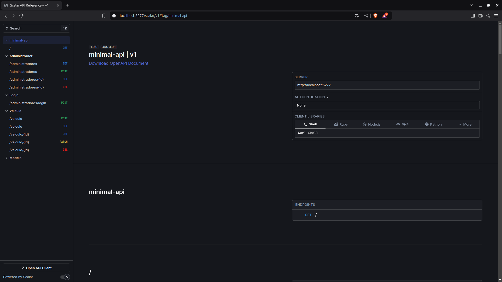
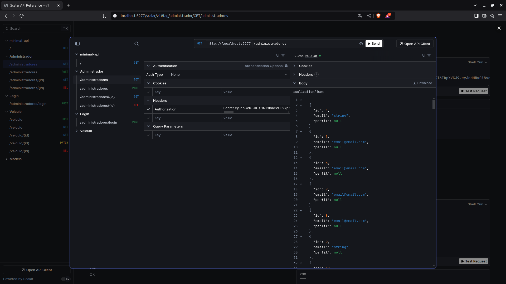

# IVehicle API

O IVehicle API é um dos projetos que desenvolvi durante o bootcamp Full Stack da [Digital Innovation One](https://www.dio.me/en) - DIO para a conclusão do módulo de Back-End com C#

## Funcionalidades
- Criar, listar, editar e excluir Administradores
- Criar, listar, editar e excluir Veículos

## O que foi implantado
- Interface Front End neste repositório: [IVehicle-Front-End](https://github.com/Arthur-Llevy/IVehicle-frontend)
- Banco de dados Mysql usando Docker
- Entity Framework para a manipulação do banco de dados
- Autenticação com Json Web Token
- Testes usando XUnit do .NET
- Biblioteca Scalar como interface gráfica para as rotas da API

## Mídias do projeto
**Interface inicial do Scalar**



**Teste de uma requisição**



## Como rodar o projeto
1. Certifique-se que o dotnet na versão 9.0 ou superior está instalado em sua máquina. Use o comando abaixo para verficiar:

```bash
dotnet --version
```
Caso não seja retornada a versão do dotnet, o mesmo não está instalado em sua máquina

1.1 Também certifique-se que o docker está instalado em sua máquina
```bash
docker --version
```
Caso não seja retornada a versão do docker, o mesmo não está instalado em sua máquina


2. Clone o projeto para um diretório de sua preferência
```bash
git clone git@github.com:Arthur-Llevy/minimal-api.git
```

3. Navege até o projeto
```bash
cd ./minimal-api
```

4. Inicialize o banco de dados com o docker
```bash
docker compose up --build
```

***Observação*** a flag "--build" só é necessária na primeira vez que você executa o comando. Da segunda em diante, basta executar "docker compose up".

5. Para rodar a api, vá até a pasta /Api
```bash
cd ./Api
```

6. Baixe as dependências
```bash
dotnet restore
```

7. Inicie o projeto
```bash
dotnet watch run
```


Irá aparecer algo semelhante a mensagem abaixo em seu terminal, contento as portas onde você pode acessar à api
<pre>
info: Microsoft.Hosting.Lifetime[14]
      Now listening on: http://localhost:5277
info: Microsoft.Hosting.Lifetime[0]
      Application started. Press Ctrl+C to shut down.
info: Microsoft.Hosting.Lifetime[0]
      Hosting environment: Development
info: Microsoft.Hosting.Lifetime[0]
      Content root path: /minimal-api/Api   
</pre>

8. (Opicional) Acessar a UI do Scalar
Navege até a rota 
<pre>
http://localhost:<"porta">/scalar/v1
</pre>

9. Rodar os testes
Vá para a pasta ./Tests localizada na raiz do projeto
```bash
    cd ../Tests
```

10. Baixar dependências
```bash
    donet restore
```

11. Execute os testes
```
    dotnet test
```


---

[ENGLISH]

---

# IVehicle API

The IVehicle API is one of the projects I developed during the Full Stack bootcamp at [Digital Innovation One](https://www.dio.me/en) - DIO to complete the Back-End with C# module.

## Functionalities
- Create, list, edit and delete Administrators
- Create, list, edit and delete Vehicles

## What has been deployed
- Front End interface in this repository: [IVehicle-Front-End](https://github.com/Arthur-Llevy/IVehicle-frontend)
- Mysql database using Docker
- Entity Framework for handling the database
- Authentication with Json Web Token
- Testing using .NET's XUnit
- Scalar library as a graphical interface for API routes

## Project media
**Scalar's initial interface**


**Testing a request**


## How to run the project
1. Make sure that dotnet version 9.0 or higher is installed on your machine. Use the command below to check:

```bash
dotnet --version
```
If the dotnet version is not returned, it is not installed on your machine

1.1 Also make sure that docker is installed on your machine
```bash
docker --version
```
If the docker version is not returned, it is not installed on your machine

2. Clone the project to a directory of your choice
```bash
git clone git@github.com:Arthur-Llevy/minimal-api.git
```

3. Navigate to the project
```bash
cd ./minimal-api
```

4. Initialize the database with docker
```bash
docker compose up --build
```

***Note*** the "--build" flag is only necessary the first time you run the command. From the second step onwards, just run "docker compose up".

5. To run the API, go to the /Api folder
```bash
cd ./Api
```

6. Download the dependencies
```bash
dotnet restore
```

7. Start the project
```bash
dotnet watch run
```

Something similar to the message below will appear in your terminal, containing the ports where you can access the API
<pre>
info: Microsoft.Hosting.Lifetime[14]
Now listening on: http://localhost:5277
info: Microsoft.Hosting.Lifetime[0]
Application started. Press Ctrl+C to shut down. info: Microsoft.Hosting.Lifetime[0]
Hosting environment: Development
info: Microsoft.Hosting.Lifetime[0]
Content root path: /minimal-api/Api
</pre>

8. (Optional) Access the Scalar UI
Navigate to the path
<pre>
http://localhost:<"port">/scalar/v1
</pre>

9. Run the tests
Go to the ./Tests folder located in the project root
```bash
cd ../Tests
```

10. Download dependencies
```bash
donet restore
```

11. Run the tests
```
dotnet test
```

